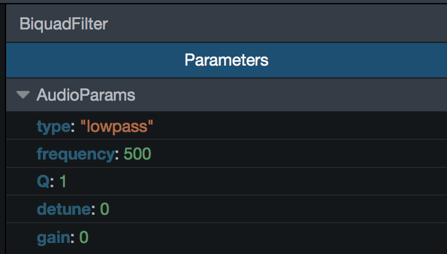
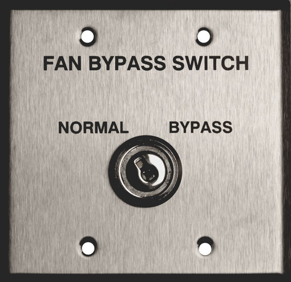

class: center, middle

# Web Audio Tools

???

Notes for the _first_ slide!

---
background-image: url(images/webaudio.png)
class: center, middle
# INSPECTING STATE IS HARD
---
background-image: url(images/laptopscream.jpg)
class: center, top 
# DEBUGGING WITH EARS IS HARD
---
# Who Is This

.left-column[
  ## Jordan Santell
  ### Firefox Dev Tools
  ### @jsantell
]
.right-column[]

---
background-image: url(images/tooltime.jpg)
class: center, top 
# IT'S TOOL TIME

---
background-image: url(images/graph.png)

# Context Routing

## [simple](http://jsantell.github.io/dsp-with-web-audio-presentation/examples/wub2.html)
## [complex](https://webaudiodemos.appspot.com/Vocoder/index.html#)

---
# Inspector

---
background-image: url(images/automation.png)
# Automation

[demo](examples/automation.html)

---
background-image: url(images/content.jpg)
---
# Creating content tools

## 1) [Instrumentation](https://github.com/jsantell/web-audio-instrumentation)
## 2) GUI

---

# Example 

## [Modified Web Audio Playground](http://localhost:8888/webaudioplayground/)

---

background-image: url(images/businessman.jpg)
# Priviledged Code

---

# Garbage Collection

.center[]

## [example](http://jergason.github.io/react-webaudio-drum-machine/)

---

# Bypassing Nodes

.center[]

## [example](http://jsantell.github.io/dsp-with-web-audio-presentation/examples/wub2.html)

---

class: dark
background-image: url(images/future.jpg)
# The Future

## Memory/CPU Usage per node
## Rendering waveforms of a signal
## Extension Tool

---

# Code

## [jsantell/web-audio-tools-2015](https://github.com/jsantell/web-audio-tools-2015/)
## [jsantell/web-audio-instrumentation](https://github.com/jsantell/web-audio-instrumentation)
## [jsantell/web-audio-automation-timeline](https://github.com/jsantell/web-audio-automation-timeline)
## [jsantell/web-audio-tools](https://github.com/jsantell/web-audio-tools)

---

# Thanks!

## Jordan Santell
## @jsantell
